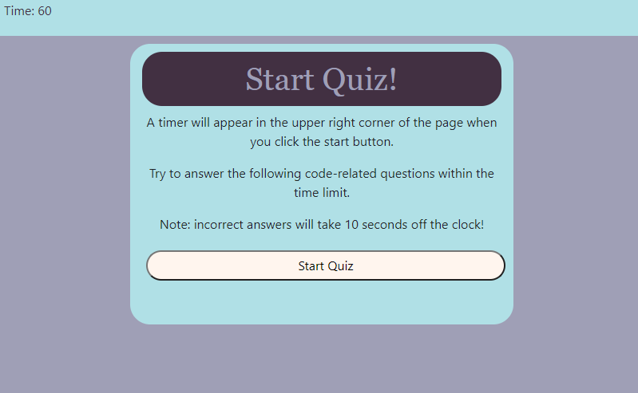

# Coding-Quiz

;

## Demo
(https://samisully.github.io/Coding-Quiz/)

## Description 

A single page javascript application that will generate 5 questions to ask the user about javascript. When the user starts the quiz, the timer starts, and the quiz will end either when the user has awnsered the last question, or the timer has reached zero.
The user then can enter their initials which are then stored in their local storage.

## Installation

Install the files directly through the github and they are ready to go!

## Usage

Free useage.

## Credits

© Sami Sully

Lots of help gained from Georgia Tech full time bootcamp class students and instructors

And lots of help from the resources:

www.w3schools.com

https://developer.mozilla.org/en-US/docs/Web/JavaScript